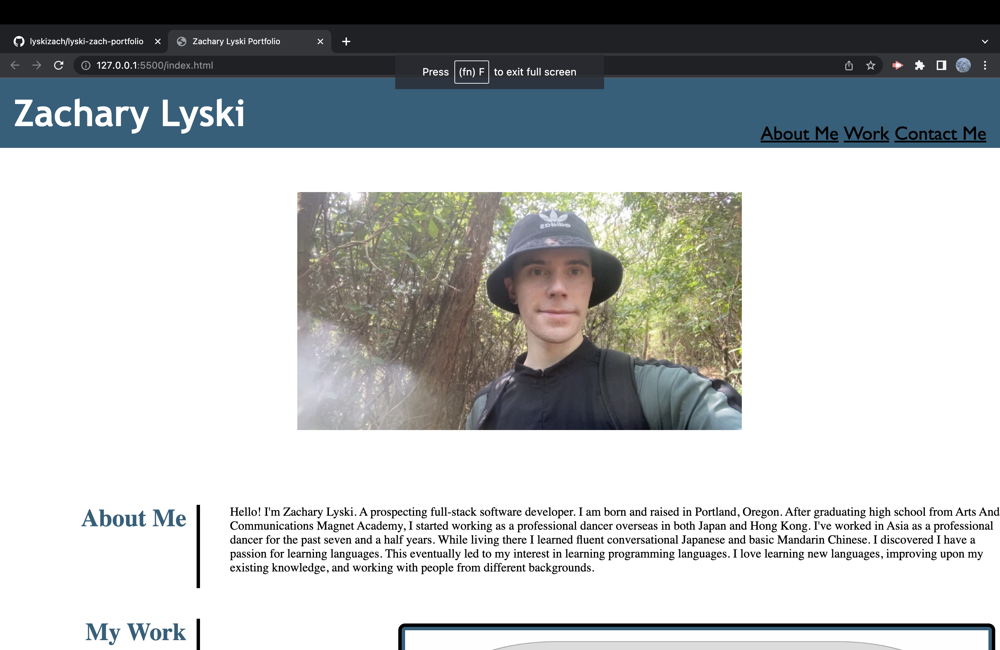

# Zachary Lyski's Portfolio

In this challenge, I created a professional portfolio for myself based upon the mock up and the acceptance criteria. The purpose was to integrate my knowledge of foundational HTML and also advanced CSS. I can now build upon this portfolio for my future endeavors.

## Screenshot Of Deployed Link

## URL
https://lyskizach.github.io/lyski-zach-portfolio/